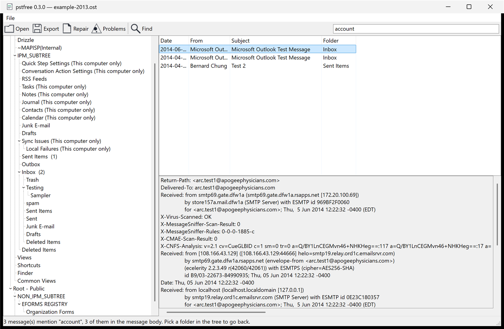

# pstfree

Read, export and **repair** Outlook `.pst` and `.ost` files on Windows. No Outlook, no
licence, no per-mailbox fee, no fake progress bar. MIT licensed, free forever.

Two self-contained executables. Run them, close them, delete them. No installer, no
service, nothing left behind — and neither one ever asks for a password, because a PST
password is not a lock.

**Delete both of a PST's B-tree roots and it still recovers every message, byte for byte —
then writes the whole thing back out as a clean file Outlook can open.** At any size: the
32MB ceiling on rebuilding is gone as of v0.2.0, and a sweep of a 400MB file went from 14
seconds to 0.4.



Sibling project to [vncfree](https://github.com/sp00nznet/vncfree), same attitude: find
the Windows payware, read the published spec it is hiding behind, give it away.

## Why

There is an entire industry selling PST tools for $50–$300. "PST Repair." "OST to PST
Converter." "PST Password Recovery." Kernel, Stellar, SysTools, DataNumen, Aryson — dozens
of near-identical products with the same SEO blogspam, the same three-pane screenshot, and
the same free trial that shows you your own email and then asks for money before it will
save it.

Here is what they are selling:

- **The file format is published by Microsoft.** [MS-PST] is a public, versioned,
  several-hundred-page specification. Not reverse-engineered, not leaked — downloadable.
- **The "password" is not encryption.** A PST password is stored as a **CRC32 of the
  password**. The block obfuscation uses a **fixed table with no key at all**, identical
  whether the file has a password or not. MS-PST section 5 calls the two ciphers
  "**keyless**" in as many words. The products charging $30–$50 to "recover" a PST password
  are charging you to skip an `if` statement. pstfree reads a password-protected file and
  never asks; there is no code in it that could.
- **Repair is the only genuinely hard part** — and the part the marketing is vaguest about.

**If anyone tries to sell you this software, they're scamming you. Walk away.**

### The clock

Classic Outlook's opt-out phase starts April 2026; enterprises stop being able to defer in
March 2027; support ends entirely in **Q2 2029**. New Outlook is a web client — it does not
mount PST files, it *imports* from them. `scanpst.exe`, the only free repair tool, ships
with classic Outlook and leaves on the same schedule.

So twenty-plus years of archives, legal holds and ex-employee `.ost` files are about to
have no first-party reader at all. That is the moment the $300 tools are waiting for.
Better if something free is standing there instead.

### Prior art, credit where due

[libpff] is the serious one — the deepest format coverage anywhere, and the reference this
project measures itself against on every release. [XstReader] is the closest existing free
Windows GUI. [java-libpst], [libpst] and [freepst] are all real work by people who got
there first, and freepst supplies the public test fixtures used here.

None of them is a bad project and none of this is a complaint about their code. The gap is
not "can a PST be parsed" — that was solved years ago. The gap is that **nothing free
seriously attempts repair**: libpff recovers deleted items from an *intact* file, which is
a different and also impressive problem. When `scanpst.exe` gives up, the free world
currently gives up too, and that is the entire reason the payware has a business. The
longer version is in [docs/prior-art.md](docs/prior-art.md).

## Try it

```
cargo build --release
target\release\pstfree-gui.exe archive.pst     the window
target\release\pstfree.exe archive.pst --tree  the command line
```

**This is a password-protected PST.** No password was set, supplied or requested:

```
> pstfree.exe passworded.pst --tree
(root)
  Top of Personal Folders
    Inbox
    Calendar
    Contacts  (2)
    ...
  Freebusy Data  (1)
```

Here is a PST with **both** B-tree root pages overwritten with zeroes — as dead as
`scanpst` can describe — read, and then written back out as a working file:

```
> pstfree.exe torn.pst --list
Block index unreadable. Carved 184 blocks out of the file itself.
Node index unreadable. Swept 128 nodes from 27 surviving pages.

date              folder        from        subject
2016-08-02 00:27  Calendar      Unknown     Test appointment  [22533 bytes]
2014-05-25 13:58  Contacts      Unknown     test dist list  [1164 bytes]

> pstfree.exe torn.pst --rebuild fixed.pst --salvage
Wrote fixed.pst: 128 node(s), 184 block(s), 125952 bytes.
```

libpff refuses to open `torn.pst` and reads all four messages out of `fixed.pst`.

| command | what it does |
|---|---|
| `--tree` | the folder tree, with message counts |
| `--list` | every message: date, folder, sender, subject |
| `--props <nid>` | every property on one node, named where the file names them |
| `--export <dir> [--format eml\|mbox\|msg]` | write the mail out |
| `--rebuild <out.pst>` | write a clean copy with a fresh index |
| `--verify` | check every checksum, and what a sweep would recover |
| `--salvage` | on any command: ignore the header's index and rebuild it |

## What it does

**Reading** — Unicode PST and OST. Folder tree, messages, properties, attachments,
embedded messages, plain/HTML/compressed-RTF bodies, calendar and contacts. Named
properties resolved through the file's own map. Password ignored, because there is nothing
there to ignore.

**Export** — `.eml` per message with attachments inline, `.mbox` per folder, or `.msg` with
the MAPI properties kept. Nothing is invented: no timezone the file does not record, no
character set re-guessed. Nothing stops: one unreadable message is counted and named, and
the rest are written. See [docs/exporting.md](docs/exporting.md).

**Repair** — the differentiator. Validate every checksum and say in plain language what is
wrong; rebuild the node and block B-trees from surviving pages; carve blocks straight out
of the file with no index at all; and write the result back out as a clean `.pst`, at any
size. See [docs/repair.md](docs/repair.md).

**Not in scope** — writing to a live Outlook profile, MAPI, Exchange, and new Outlook's own
undocumented local store. Reading a file is a different job from being a mail client.

## Known limits

Stated plainly, because a repair tool that overstates itself is the thing this replaces.

- **ANSI PST (Outlook 97–2002) is refused, not half-parsed.** Different header layout, 2GB
  ceiling. No sample has turned up to build it against.
- **`--rebuild` writes 512-byte-page Unicode PSTs only.** An OST is 4K pages and
  zlib-compressed blocks, so converting one is a format conversion rather than a repair.
  It refuses and says so.
- **No rebuild has ever been opened by Outlook**, because there is no Outlook here. libpff
  opens them and every block in them re-reads and re-checksums, which is evidence but is
  not that claim.
- **Where FMap and FPMap pages recur is still unknown.** A rebuild works around it instead
  of answering it — it keeps every slot the four map pages could occupy clear, in every
  section of the file, which costs 0.8% and cannot be wrong in the direction that destroys
  data. Settling it properly needs a PST over 125MB written by Outlook.
- **Attachment extraction has never seen a real attachment**, because none of the three
  public fixtures has one.
- **Cyclic encoding has never decoded a real file** — no fixture uses it.
- **Recovery has only been tested against damage this repo inflicted itself.** There is no
  public corpus of broken PSTs; every route was checked and none exists.

The full list, including the places the first reading of the spec was wrong, is in
[docs/findings.md](docs/findings.md).

## How it is tested

47 tests, against a real PST, a real 2013 OST and a real password-protected PST — the
public fixtures from [freepst], fetched by `tests\fetch-fixtures.ps1`. Test files are never
committed, because real PSTs contain real mail; the tests skip rather than fail when they
are absent.

The check that counts is [libpff], the reference implementation nearly every other PST tool
wraps. On intact files the two agree exactly — not just on message counts but on **686
properties across 10 messages, id for id**. On six damaged files libpff opened none and
pstfree opened all six. Details, plus the fuzzer and the one piece of ground truth a PST
can offer about its own recovery, in [docs/testing.md](docs/testing.md).

## Documentation

- [docs/repair.md](docs/repair.md) — how recovery works, and writing the file back out
- [docs/exporting.md](docs/exporting.md) — `.eml`, `.mbox`, `.msg`, and the rules
- [docs/testing.md](docs/testing.md) — libpff head-to-head, fuzzing, ground truth
- [docs/findings.md](docs/findings.md) — what the spec got right, and what it omits
- [docs/roadmap.md](docs/roadmap.md) — milestones, and what is left
- [docs/prior-art.md](docs/prior-art.md) — the survey that justified building this

## Building

Rust, and nothing else. One dependency ([miniz_oxide], for the zlib-compressed blocks an
Outlook 2013 OST uses) plus [windows-sys] for the Win32 bindings. No build script, no
vendored C, no runtime to install.

```
cargo build --release
cargo test
```

## Credits

- **Microsoft**, for publishing [MS-PST] openly. This project is a reader written from the
  specification; the `mpbbCrypt` substitution table in `src/crypt.rs` is the one piece of
  data taken from it directly, and is validated on the way in.
- **[libpff]** (Joachim Metz), for being the reference every claim here is checked against.
- **[freepst]** (Bob Rudis), for the public PST/OST test fixtures.
- **[XstReader]**, **[java-libpst]** and **[libpst]**, for getting there first.
- [miniz_oxide] and [windows-sys], the only two dependencies, both MIT.

## Licence

MIT. See [LICENSE](LICENSE). Free forever, for everyone. The whole point is that nobody
pays for this.

[MS-PST]: https://learn.microsoft.com/en-us/openspecs/office_file_formats/ms-pst/
[libpff]: https://github.com/libyal/libpff
[XstReader]: https://github.com/Dijji/XstReader
[java-libpst]: https://github.com/rjohnsondev/java-libpst
[libpst]: https://github.com/pst-format/libpst
[freepst]: https://github.com/hrbrmstr/freepst
[miniz_oxide]: https://github.com/Frommi/miniz_oxide
[windows-sys]: https://github.com/microsoft/windows-rs
